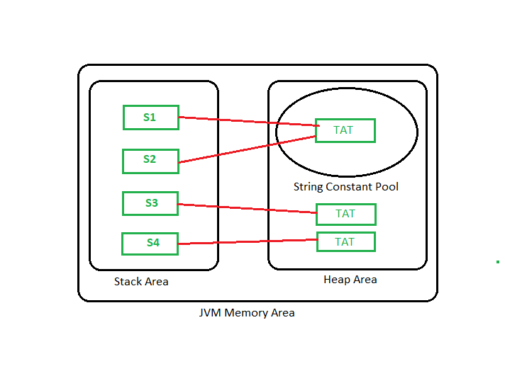

# Strings
---

### Why did the String pool move from PermGen to the normal heap area? 
PermGen space is limited, the default size is just 64 MB. it was a problem with creating and storing too many string objects in PermGen space. That’s why the String pool was
moved to a larger heap area. To make Java more memory efficient, the concept of string literal is used. By the use of
the ‘new’ keyword, The JVM will create a new string object in the normal heap area even if the same string object is
present in the string pool.

For example:

String a=new String(“Bhubaneswar”)

Let us have a look at the concept with a java program and visualize the actual JVM memory structure:

Program:

```java
    class StringStorage {
    public static void main(String[] args) {
        String s1 = "TAT";
        String s2 = "TAT";
        String s3 = "TAT";
        String s4 = "TAT";
        System.out.println(s1);
        System.out.println(s2);
        System.out.println(s3);
        System.out.println(s4);
    }
}
```

Output TAT TAT TAT TAT 
JVM Memory Area


---
### Why string objects are immutable in java?

- Because java uses the concept of string literal. Suppose there are 5 reference variables, all referes to one object “sachin”. If one reference variable changes the value of the object, it will be affected to all the reference variables. That is why string objects are immutable in java.
---
- As applications grow, it’s very common for String literals to occupy a large area of memory, which can even cause redundancy. So, in order to make Java more efficient, the JVM sets aside a special area of memory called the “String constant pool”.

- When the compiler sees a String literal, it looks for the String in the pool. If a match is found, the reference to the new literal is directed to the existing String and no new String object is created. The existing String simply has one more reference. Here comes the point of making String objects immutable:
