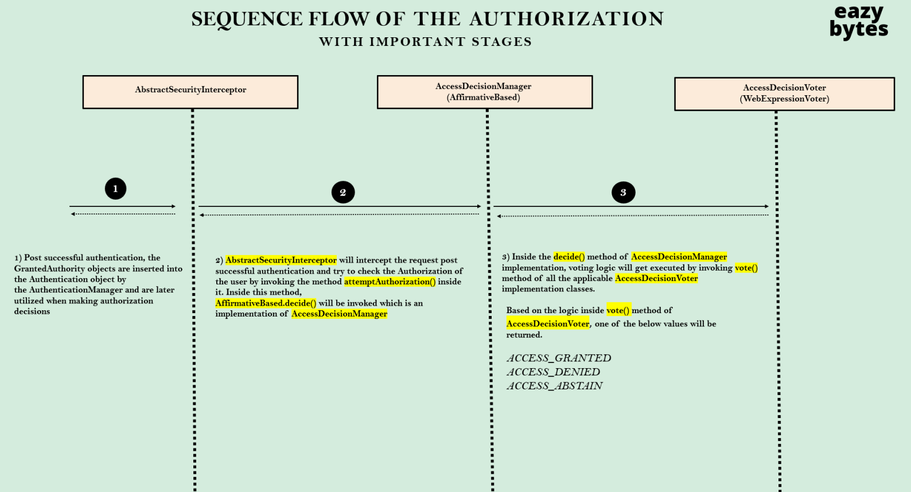
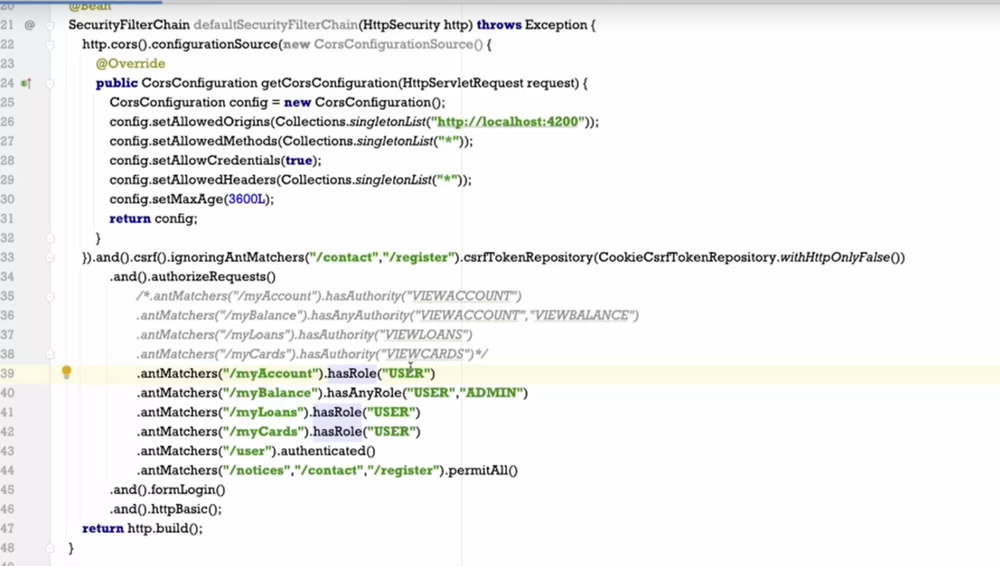
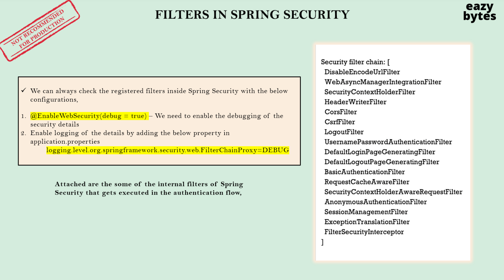
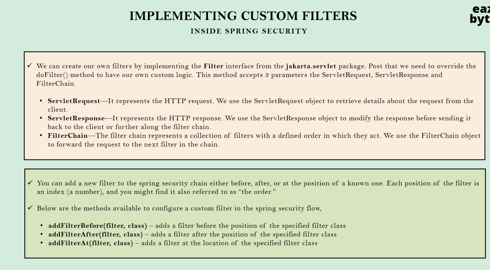
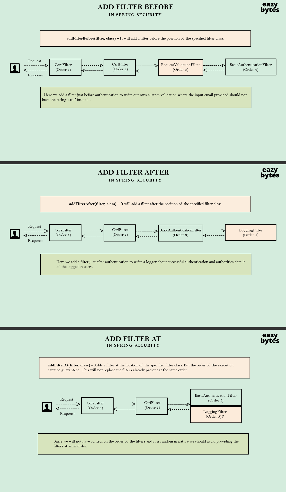
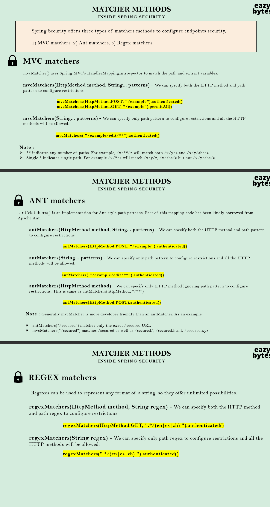

# Spring Security

---

- In udemy course, imp lectures, 8, 9, 10, 17
- The field class which brings up default login page once we add spring-security dependency in my spring-boot
  application is -> `DefaultLoginPageGeneratingFilter` and the method where the html code is written
  is `generateLoginPageHtml`
- Once u provide the credentials to login, the authentication is done by `UsernamePasswordAuthenticationFilter` class by
  calling `attemptAuthentication` method, where the request and response are sent as parameter to this method, 2 steps
  takes place in this method
    - First one authentication is object is created based on the username and password provided by the user during login
    - Second it invokes `authenticate` method present inside the `AuthenticationManager` by passing the authentication
      token as parameter
    - So inside this `authenticate` method, my `AuthenticationManager`, which is provider manager, is going to try all
      the authentication providers available inside the spring security
      framework (Eg : login by userCredentials or oAuth login or login viaFingerPrint) and it is going to invoke
      the `authenticate` method in each of these providers by default.
    - So `DaoAuthenticationProvider` is the default authenticationProvider used by spring-security framework to perform
      the authentication


---

### Changing the default security configurations

- So `WebSecurityConfigurerAdapter` is not recommended approach because before spring security 5.7 version, everyone
  used to use this class. Like whenever they implement this class inside their custom configurations, they can override
  the `configure` method, But please do not use this `WebSecurityConfigurerAdapter`.The reason is it is deprecated and
  the reason why it is deprecated is, If you see we have to extend this `WebSecurityConfigurerAdapter` class and
  override this `configurer` method, whereas with the other approach we have to create a being of type security filter
  chain. And since spring security team want everyone to move towards component style of defining or being style of
  defining the security requirements, they introduce this new style of configurations from the spring security 5.7
  version. So that's why it is recommended to use the approach of defining a bean of type `SecurityFilterChain`
- We can also override this behavior by creating our own security filter chain for the same.
- 
- 

---

- When you create custom login api, to login into the system, we need to pass the email/username and password as a
  header where the headerName being Authorization and value being base64 encrypted username and password separated by
  colon (:),
- which result in triggering `BasicAuthenticationFilter` class where `doFilterInternal` method is called, which reads
  the `Authroization` header and decrypt and separate out the username and password and convert in
  into  `UsernamePasswordAuthenticationToken`
- which is being passed to `AuthenticationManager` -> `AuthenticationProvider` to perform authentication, once
  authentication is done successfully, spring security will call the custom login controller and performs the business
  logic written inside that controller

---



---

### SecurityFilterChain config with cors, csrf, authorities and roles configuration

-

---
Add custom filter before a specific filter



```java

@Configuration
public class ProjectSecurityConfig {

    @Bean
    SecurityFilterChain defaultSecurityFilterChain(HttpSecurity http) {
        http.securityContext().requireExplicitSave(false)
                .and().cors().configurationSource(new CorsConfigurationSource() {
                    @Override
                    public CorsConfiguration getCorsConfiguration(HttpServletRequest request) {
                        CorsConfiguration config = new CorsConfiguration();
                        config.setAllowedOrigins(Collections.singletonList("http://localhost:4200"));
                        config.setAllowedMethods(Collections.singletonList("*"));
                        config.setAllowCredentials(true);
                        config.setAllowedHeaders(Collections.singletonList("*"));
                        config.setMaxAge(3600L);
                        return config;
                    }
                }).and().csrf().ignoringRequestMatchers("/contact", "/register").csrfTokenRepository(CookieCsrfTokenRepository.withHttpOnlyFalse())
                .and().addFilterBefore(new RequestValidationBeforeFilter(), BasicAuthenticationFilter.class)
                .addFilterAt(new AuthoritiesLoggingAtFilter(), BasicAuthenticationFilter.class)
                .addFilterAfter(new AuthoritiesLoggingAfterFilter(), BasicAuthenticationFilter.class)
                .authorizeHttpRequests()
                .requestMatchers("/myAccount").hasRole("USER")
                .requestMatchers("/myBalance").hasAnyRole("USER", "ADMIN")
                .requestMatchers("/myLoans").hasRole("USER")
                .requestMatchers("/myCards").hasRole("USER")
                .requestMatchers("/user").authenticated()
                .requestMatchers("/notices", "/contact", "/register").permitAll()
                .and().formLogin()
                .and().httpBasic();
        return http.build();
    }

    @Bean
    public PasswordEncoder passwordEncoder() {
        return new BCryptPasswordEncoder();
    }

}
```



---
### GenericFilterBean & OncePerRequestFilter

- But here you may have a question, if my OncePerRequestFilter already implemented the doFilter method by overriding it then where can I define my own business logic? Previously, we are writing all our business logic inside the doFilter method. If you go and check any of the filter that we have defined, we are writing all our business logic inside the doFilter method. But in the scenario of OncePerRequestFilter the story will be different. You just have to make sure you are writing all your business logic inside a method called doFilterInternal. So this doFilterInternal is an abstract method. You can override this and write all your logic. Internally, my OncePerRequestFilter will try to take care of invoking this method only once per request. And this filter also has other type  of methods which are super helpful.
---

### Matchers



- if you have a web application where you strictly have all the REST APIs you can always go with the Ant Matchers
  because usually REST APIs will be invoked by the other core written inside the other languages, and they will not be
  making any mistake while invoking your paths like by appending the extensions like .html or giving a slash towards the
  end of the path.Whereas, if you have an application where there are some user facing webpages like HTML or spring MVC
  flows, then please use the MVC Matchers.But apart from this user-friendly, developer friendly stuff there is no
  significant difference between anti Matchers and MVC Matchers.
---
### JWT TOKEN

- maven dependency required to implement jwt token implementation in the spring boot project
```xml
<dependencies>
  <dependency>
    <groupId>io.jsonwebtoken</groupId>
    <artifactId>jjwt-api</artifactId>
    <version>0.11.5</version>
  </dependency>
  <dependency>
    <groupId>io.jsonwebtoken</groupId>
    <artifactId>jjwt-impl</artifactId>
    <version>0.11.5</version>
    <scope>runtime</scope>
  </dependency>
  <dependency>
    <groupId>io.jsonwebtoken</groupId>
    <artifactId>jjwt-jackson</artifactId> <!-- or jjwt-gson if Gson is preferred -->
    <version>0.11.5</version>
    <scope>runtime</scope>
  </dependency>
</dependencies>
```
--
- As by default spring-security create JSESSIONID, to override this session id with out jwt token, we need to disable this default behaviour spring-security, to do that we need to add below line in our SecurityFilterChain configuration
- 

```java
@Configuration
public class WebSecurityConfig {

  @Bean
  SecurityFilterChain defaultSecurityFilterChain(HttpSecurity http) throws Exception {
    http.sessionManagement().sessionCreationPolicy(SessionCreationPolicy.STATELESS).and() // this line is used to disable the default JSESSIONID (session creation policy by spring-security)
            .cors().configurationSource(new CorsConfigurationSource() {
              @Override
              public CorsConfiguration getCorsConfiguration(HttpServletRequest request) {
                CorsConfiguration config = new CorsConfiguration();
                config.setAllowedOrigins(Collections.singletonList("http://localhost:4200"));
                config.setAllowedMethods(Collections.singletonList("*"));
                config.setAllowCredentials(true);
                config.setAllowedHeaders(Collections.singletonList("*"));
                config.setExposedHeaders(Arrays.asList("Authorization")); // this is used to expose our new to jwt token, and tell browser to use this token  
                config.setMaxAge(3600L);
                return config;
              }
            }).and().formLogin()
            .and().httpBasic();
    return http.build();
  }
}
```

- With this we are communicating to the Spring security framework. Please do not generate any JSON IDs. I'm going to take care of my own session management or token management inside my web application.

config.setExposedHeaders(Arrays.asList("Authorization")); // this is used to expose our new to jwt token, and tell browser to use this token

- So inside cors configuration, we need to define those details telling to the spring security framework. Please allow to send this header information as part of the response that I'm going to send from the backend application to the client application. Then only my browser is going to accept that new header which I'm going to send in as part of the response. So how we are going to mention that is just after this set load headers, we are going to define one more line of code. Using these expose headers, we can expose the headers that we are sending inside the response to the client application. Otherwise my browser is not going to accept this header because there are two different origins are trying to communicate.

---
### KeyCloack - oAuth 2
If u want to convert the spring boot application as a resource server, u need to add a maven dependency, `spring-boot-starter-oauth2-resource-server`
