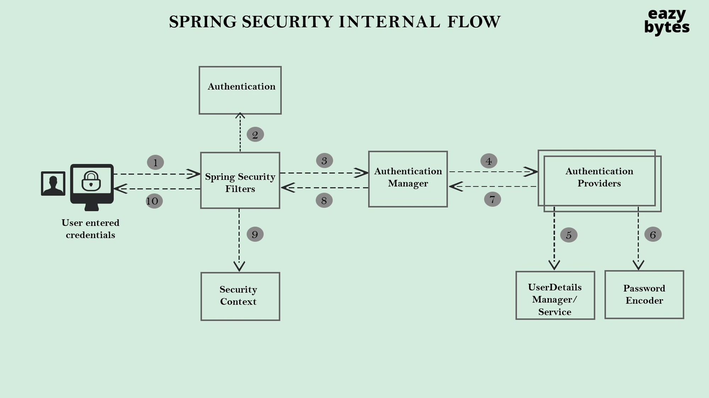
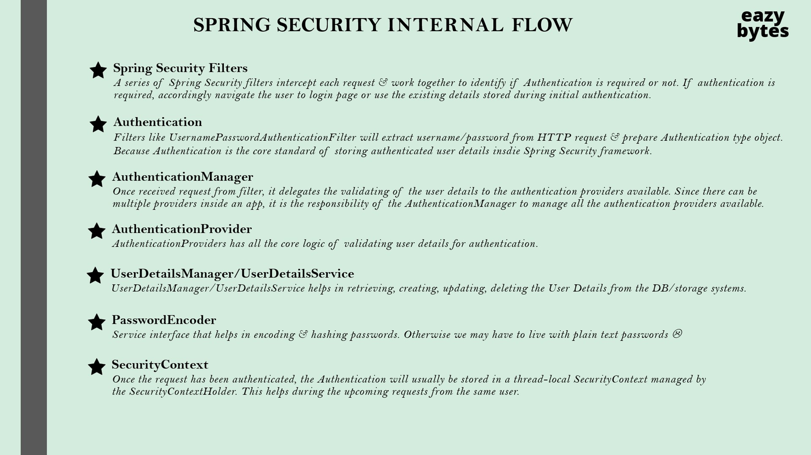
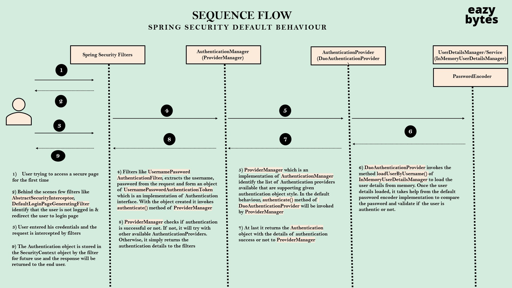
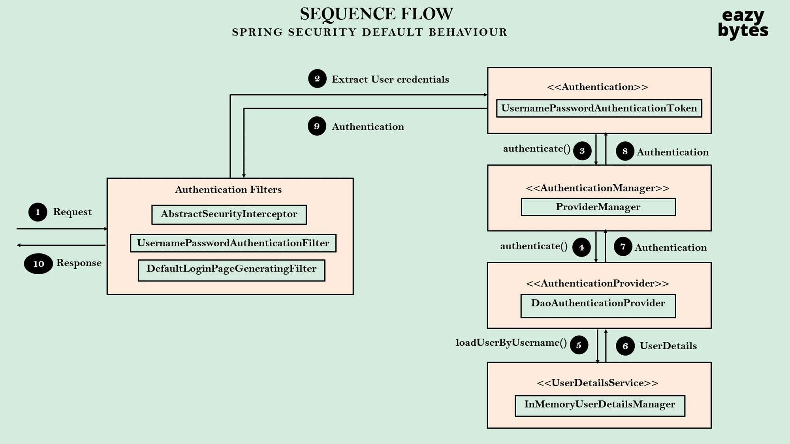
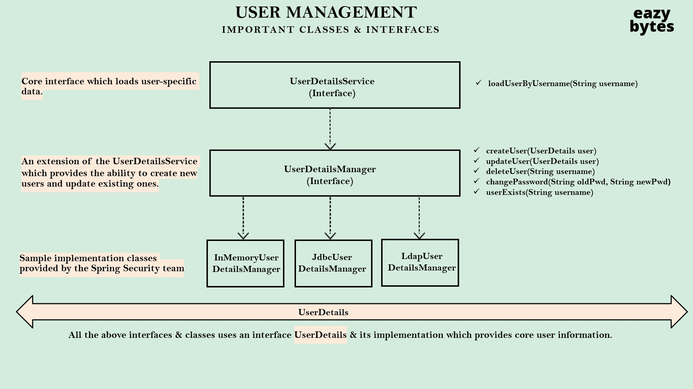
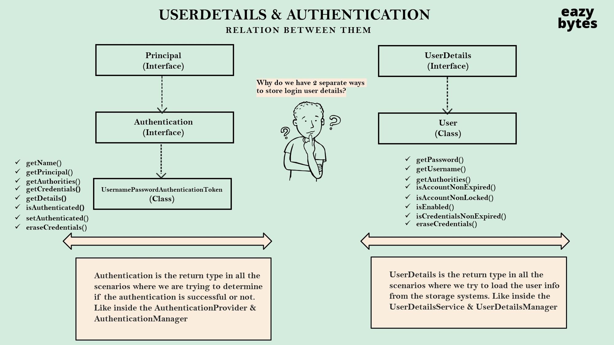

# Spring Security

---
- In udemy course, imp lectures, 8, 9, 10, 17
- The field class which brings up default login page once we add spring-security dependency in my spring-boot application is -> `DefaultLoginPageGeneratingFilter` and the method where the html code is written is `generateLoginPageHtml`
- Once u provide the credentials to login, the authentication is done by `UsernamePasswordAuthenticationFilter` class by calling `attemptAuthentication` method, where the request and response are sent as parameter to this method, 2 steps takes place in this method
  - First one authentication is object is created based on the username and password provided by the user during login
  - Second it invokes `authenticate` method present inside the `AuthenticationManager` by passing the authentication token as parameter
  - So inside this `authenticate` method, my `AuthenticationManager`, which is provider manager, is going to try all the authentication providers available inside the spring security framework [Eg : login by userCredentials or oAuth login or login viaFingerPrint] and it is going  to invoke the `authenticate` method in each of these providers by default.
  - So `DaoAuthenticationProvider` is the default authenticationProvider used by spring-security framework to perform the authentication

---
### Changing the default security configurations
- So `WebSecurityConfigurerAdapter` is not recommended approach because before spring security 5.7 version, everyone used to use this class. Like whenever they implement this class inside their custom configurations, they can override the `configure` method, But please do not use this `WebSecurityConfigurerAdapter`.The reason is it is deprecated and the reason why it is deprecated is, If you see we have to extend this `WebSecurityConfigurerAdapter` class and override this `configurer` method, whereas with the other approach we have to create a being of type security filter chain. And since spring security team want everyone to move towards component style of defining or being style of defining the security requirements, they introduce this new style of configurations from the spring security 5.7 version. So that's why it is recommended to use the approach of defining a bean of type `SecurityFilterChain`
- We can also override this behavior by creating our own security filter chain for the same.
- 
- 
- 