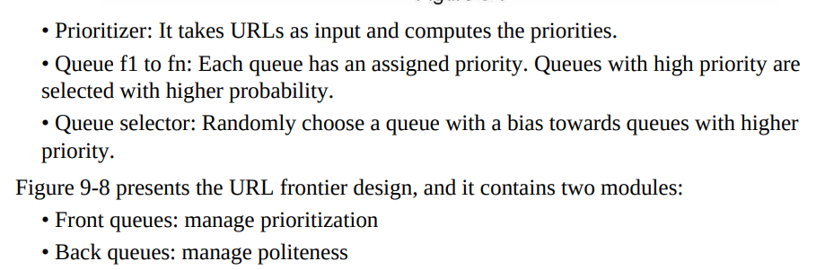

# WebCrawlers
 
---
### Different types of web crawlers
- search engine
- Copyright violation detection
- keyword based finding
- web malware detection
- web analytics
- datascience data

---
Feature to support in crawler
- politeness/ crawl rate
- DNS query
- Distributed crawling
- priority crawling
- duplicate detection

---

---

---

